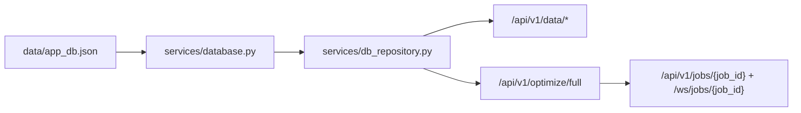

# Backend Architecture

## Runtime Source

`data/app_db.json` is the runtime source of truth. The API does not read raw Excel workbooks or processed snapshots.

The DB layer is split into two responsibilities:

- `services/database.py`: JSON table storage, schema normalization, CRUD helpers, and backwards-compatible migrations for older JSON files.
- `services/db_repository.py`: read-only domain assembly for the optimizer and `/api/v1/data/*` endpoints.

## Tech Stack

| Layer | Choice |
|-------|--------|
| API | FastAPI |
| Validation | Pydantic v2 |
| Storage | JSON database in `data/app_db.json` |
| Optimization | OR-Tools with haversine fallback |
| Geocoding | Nominatim-compatible geocoding helpers |
| Frontend serving | FastAPI static mount at `/app` |

## Runtime Flow

## API Surface

The frontend gets demo transports through:

- `GET /api/v1/data/health`
- `GET /api/v1/data/routes`
- `GET /api/v1/data/transports`
- `GET /api/v1/data/transport/{transport_id}`
- `GET /api/v1/data/customers/{customer_id}`

The optimizer runs through:

- `POST /api/v1/optimize/full`
- `POST /api/v1/optimize/full/preview`
- `GET /api/v1/jobs/{job_id}`
- `WS /ws/jobs/{job_id}`

Catalog and DB maintenance use:

- `GET/POST /api/v1/catalog/*`
- `GET/POST/PATCH/DELETE /api/v1/db/*`

There is no data bootstrap endpoint. New demo data should be written through the DB API, the catalog API, or a dedicated migration script that writes `data/app_db.json`.
